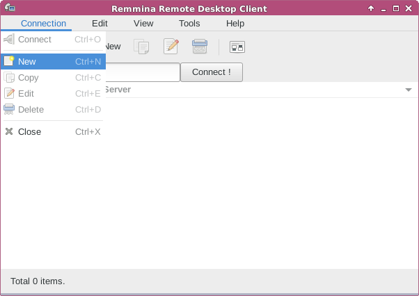
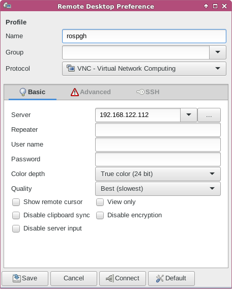
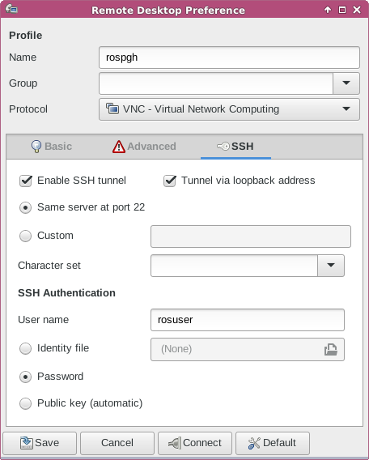
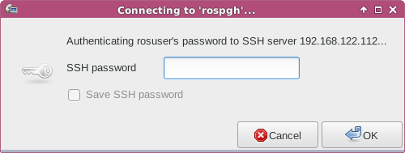
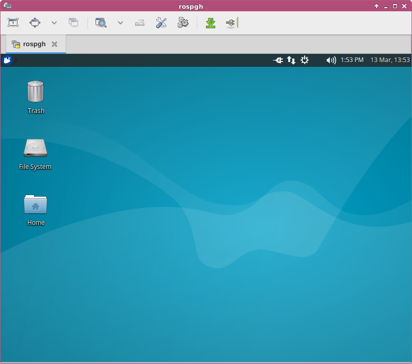
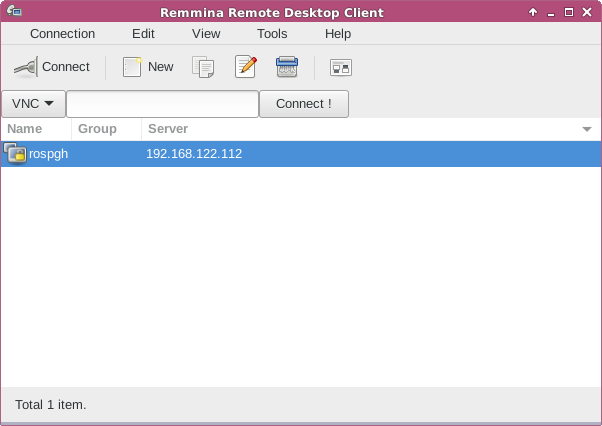

#Secure Virtual Network Computing

Start Remmina, click on *Connection* and go to *New*.

Choose *VNC* as the *Protocol*. 

Put in the DNS name, IPv4 address or IPv6 address of the server you are
trying to connect to in the server field. DNS name is recommended.

Set the Color Depth to True Color and the Quality to Best.

Click on the *SSH* tab. *Enable SSH Tunnel* and *Tunnel via loopback*
address via the checkboxes and hit the *Same server at port 22* 
radio button.

Set the username of the user you are trying to connect as.

Hit the *Connect* button and Remmina will attempt to login to the server
via a ssh tunnel. SSH will make VNC secure.

Type your password into the masked field tha says *SSH password*.

If you typed in your password correctly you will now be connected to your 
desktop via sshvnc.

When you try to connect to the server again, you will see the server in your
list of resources to connect to. If you hit the *Connect* button again, you will be 
prompted the same way as last time.
